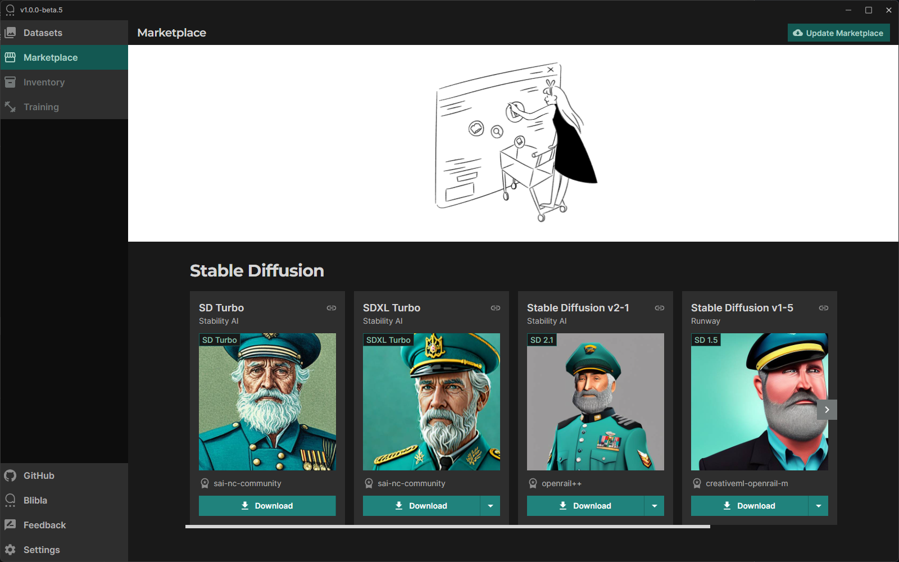

# Captain: Your Local AI Hub

Captain simplifies AI on your desktop. It's a free, open-source application that requires no complex setup — just a single .exe file. It provides a variety of AI tools and features a multi-language UI.

Captain currently supports English, German, Spanish, French, Italian, Japanese, Dutch, Polish, Portuguese, Russian, and Chinese.

    

  

    

https://github.com/blib-la/captain/assets/1148334/eecac351-ec1e-4cca-aaf7-89891c436576

<!-- toc -->

- [Key Features](#key-features)
- [Planned Features](#planned-features)
- [Getting Started](#getting-started)
  * [Installation](#installation)
  * [Detailed User Guide](#detailed-user-guide)
- [Important Note: Installation Warning for Unsigned App](#important-note-installation-warning-for-unsigned-app)
- [Community and Support](#community-and-support)
- [Contribute to Captain](#contribute-to-captain)
- [License](#license)
- [Acknowledgments](#acknowledgments)

<!-- tocstop -->

## Key Features

- **Versatile AI Tool Integration** ✅: Seamlessly connect with various AI tools and models for diverse functionalities.
- **Local and Online Modes** ✅: Operate fully offline after initial model downloads or connect with online AI services like OpenAI's GPT and RunPod.
- **Self-Contained Application** ✅: Enjoy the simplicity of a single `.exe` file with no need for installing Python dependencies or other software.
- **Open Source and Free** ✅: Accessible AI for everyone, with the full source code available for modification and extension.
- **Dynamic AI Model Marketplace** ✅: Easily download and update Stable Diffusion checkpoints directly through the in-app marketplace.
- **Image Captioning** 🖼️: Start with state-of-the-art automatic captioning powered by multiple AI methods.

## Planned Features

- **Training and Fine-Tuning** ⏳: Personalize and train AI models directly within Captain.
- **Cross-Platform Compatibility** ⏳: We're steering towards supporting Linux and macOS users soon.
- **Expanded Local Models** 🧠: Look forward to local models like CLIP for context-aware captions and Llava, offering multi-modal capabilities akin to GPT-Vision.
- **AI-Assisted Creativity** 🎨: Future updates will introduce live painting with AI.

## Getting Started

### Installation

1. Download `Captain.exe` from our official repository.
2. Run the executable to launch Captain.
3. Decide where Captain should be installed in the Installation wizard.

### Detailed User Guide

For a comprehensive walkthrough of Captain's captioning feature and detailed instructions on how to make the most of Captain, please refer to our dedicated User Guide.

[Read the Full Guide](./docs/GUIDE.md)

This guide will assist you in navigating the captioning capabilities of Captain, ensuring you can leverage the power of local AI with confidence and ease.

## Important Note: Installation Warning for Unsigned App

As Captain is currently an unsigned application, you may encounter a warning during the installation process. This is a standard notification for unsigned apps and does not indicate any security issue with Captain. Since Captain is open source, you can review the source code to ensure its safety.

If you receive a warning, please follow these steps to proceed with the installation:

1. **Windows Users**:
  - When the warning appears, click on "More info".
  - You'll then see the option to "Run anyway". Click it to proceed with the installation.

2. **Mac Users** (if applicable in the future):
  - Right-click (or Ctrl-click) the downloaded file and select "Open".
  - In the warning dialog that appears, click "Open" to proceed.

Rest assured, the integrity and security of Captain are paramount to us. If you have any concerns or questions, please feel free to review our source code or contact us directly.

Enjoy the powerful capabilities of Captain, and thank you for your trust and support! 🚀

## Community and Support

Encounter an issue or have suggestions? Head to our [issue tracker](https://github.com/blib-la/captain/issues) or engage with the community. Your feedback helps Captain sail smoothly!

## Contribute to Captain

Join us on deck! If you're looking to contribute, our [Contribution Guidelines](./.github/CONTRIBUTING.md) will help you get started.

## License

Captain is proudly open source, available under the [AGPL 3.0 License](./LICENSE).

## Acknowledgments

Hats off to our contributors, community, and everyone who supports Captain. Together, we're navigating the exciting waters of AI.

---

Embark on your AI journey with Captain at the helm!
