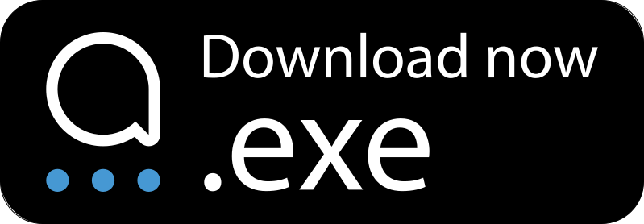

    

<h1 align="center">Captain</h1>

    
    
    

Explore, create, and innovate with Captain, your all-in-one platform to build and use AI
applications effortlessly on your own computer.

---

<!-- releases -->

  

<!-- releasesstop -->

  
  

---

## Captain in Action

Bring your ideas to life using Captain's intuitive UI. Just type in what you want to do and let
Captain's core apps transform your thoughts into vivid artworks and captivating stories.

    

---

<h2>Table of Contents</h2>

<!-- toc -->

- [Getting Started](#getting-started)
  * [Prerequisites](#prerequisites)
  * [Installation](#installation)
- [First steps](#first-steps)
  * [Download models](#download-models)
  * [Navigate Captain with a Prompt](#navigate-captain-with-a-prompt)
  * [Generate a Story](#generate-a-story)
- [Community](#community)
- [Contribute](#contribute)
- [License](#license)
- [Acknowledgments](#acknowledgments)

<!-- tocstop -->

---

## Getting Started

### Prerequisites

This is an alpha-release that has a focus on the hardware that we own ourselves, so Captain
currently only works with this base setup:

-   Windows with a NVIDIA GPU
-   [NVIDIA CUDA Toolkit for Windows](https://developer.nvidia.com/cuda-downloads?target_os=Windows&target_arch=x86_64)
    installed
-   [Latest NVIDIA driver](https://www.nvidia.com/download/index.aspx) installed for your GPU

### Installation

1. Download `Captain.exe` using the button above or from the
   [releases](https://github.com/blib-la/captain/releases)
2. Run `Captain.exe` to launch the Installation Wizard
    1. Installation Warning for Unsigned App: As Captain is currently in ALPHA, it's releases are
       not validated by Microsoft. This doesn't indicate any security issue and since Captain is
       open source, you can review the source code at any time yourself
    2. Click on "More Info"
    3. You'll then see the option to "Run anyway". Click it to proceed with the installation.
3. Decide where Captain should be installed
4. Run Captain, which will launch the Installer
5. Follow the steps, some of them take longer as Captain needs to download some large files
6. When everything is downloaded, Captain will initialize and then start
    1. When you are asked to allow [Qdrant](https://qdrant.tech/) to access your network, just allow
       it, as Captain needs Qdrant to work

🎉 Congrats, you are done with the installation.

## First steps

### Download models

Captain needs the models to use AI on your computer, so you have full control over everything.
That's why you need to download them in order to use the "Live Painting" app.

### Navigate Captain with a Prompt

You can interact with Captain by using the **Prompt**. This is a special window that you can open by
using the keyboard-shortcut: **CTRL + ALT + Space**.

When the **Prompt** is open, you can start build-in AI apps or change the settings of Captain:

-   `I want to draw something`: Select _Live Painting_ to start drawing
-   `Create a story`: Select _Generate a Story_ to generate stories based on the images you created
-   `Switch to dark mode`

### Generate a Story

Captain currently has no AI that can write text locally, so we rely on GPT-4 from OpenAI. Captain
consumes GPT via the API, which means that your data will not be used for training.

In order to use the app, you need to:

1. Create an [OpenAI API Key](https://platform.openai.com/api-keys)
2. Open the **Prompt** and type "Settings"
3. Enter your `OpenAI API Key`

Now you can generate stories by opening the `Generate a story` app.

## Community

Let's connect and tell us what you think about Captain:

## Contribute

Join us on deck! If you're looking to contribute, our
[Contribution Guidelines](./.github/CONTRIBUTING.md) will help you get started.

## License

Captain is proudly open source, available under the [AGPL 3.0 License](./LICENSE).

## Acknowledgments

Hats off to our contributors, community, and everyone who supports Captain. Together, we're
navigating the exciting waters of AI.
