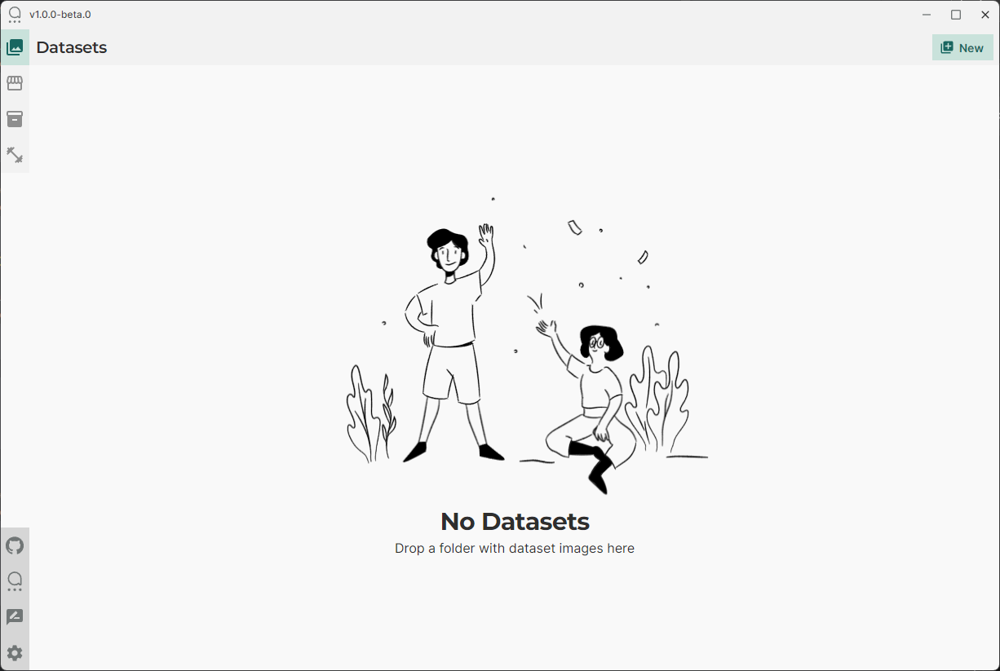
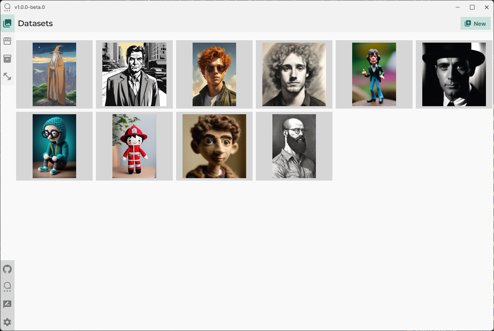
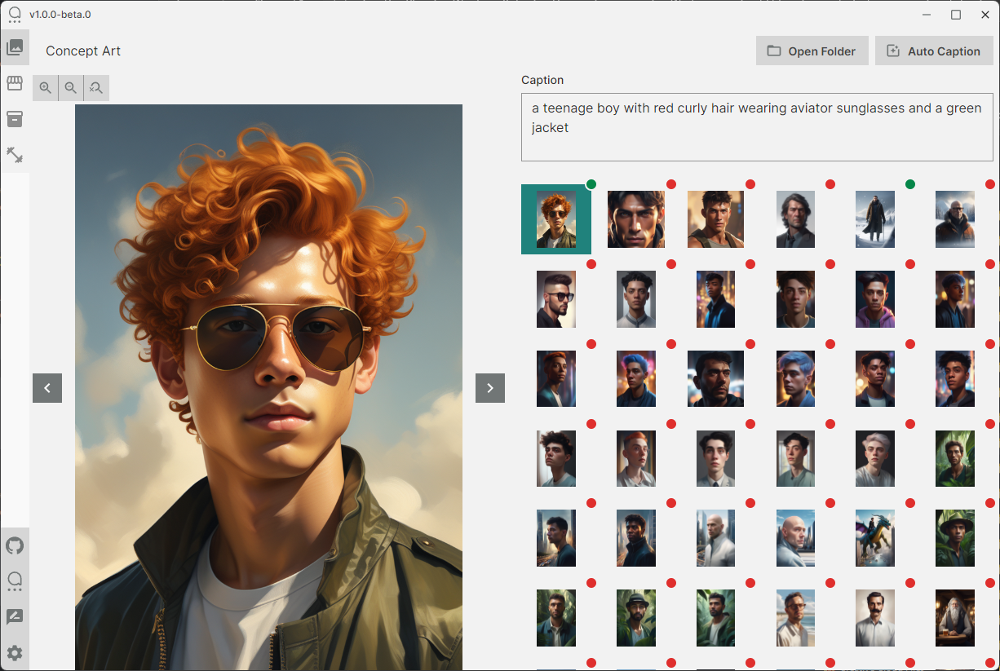
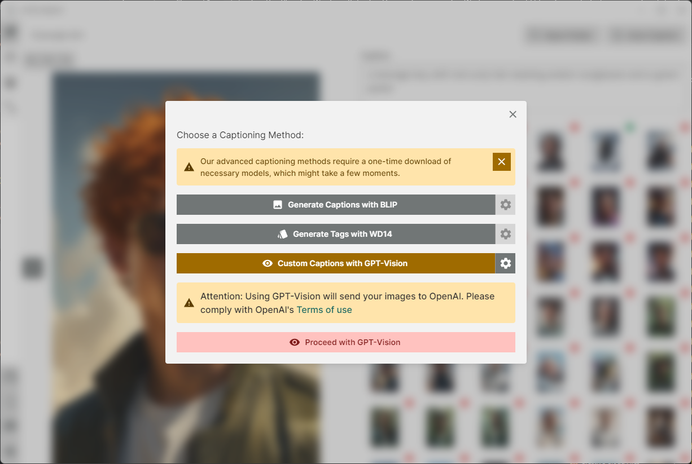
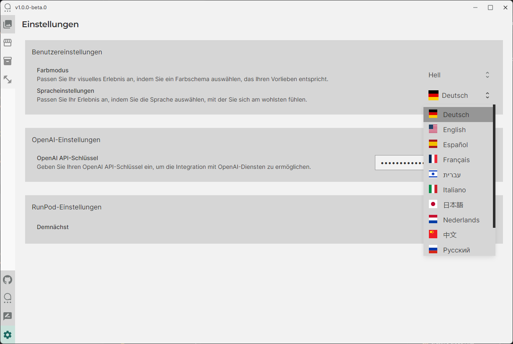
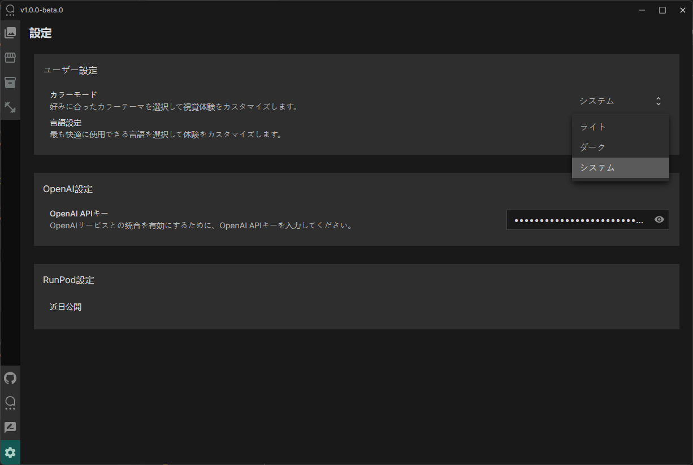

## Captain User Guide

Welcome to Captain, your all-in-one AI hub for local image processing and data management. Follow this guide to navigate through Captain's features, from your initial setup to engaging with powerful AI tools.

### Starting with Captain

**Initial Launch: No Datasets Available**
- Upon opening Captain for the first time, you'll be greeted with a message indicating "No Datasets". This is your starting point.
- Begin by dragging and dropping a folder of your image datasets directly into the application to import them.

**Importing Datasets**
- After your datasets are imported, they will appear in the 'Datasets' section, showcasing the varied visual data you've provided. Captain handles diverse image types with ease.

### Working with Images

**Viewing and Selecting Images**
- Select any image to view it in greater detail. In this detailed view, you can pan and zoom to explore every aspect of the image, allowing a close-up look at the data you'll be working with.

**Captioning Your Images**
- To caption an image, click the "Auto Caption" button. Captain will then offer various AI-driven methods for captioning, such as BLIP for automated captions or WD14 for tag generation.
- You have full control over the captioning process: start from scratch with manual captions, or use AI-generated captions as a base and refine them to your liking, incorporating a human-in-the-loop approach.

### Customizing Your Experience

**Language and Display Settings**
- In the 'Settings' menu, tailor Captain to your preferences. Choose from 12 UI languages for a personalized interface and select a color mode that's easy on your eyes.

**Integrating with OpenAI**
- Captain harnesses the power of OpenAI's API for enhanced AI functionalities. Enter your OpenAI API key in the provided field to activate these features.
- Stay tuned for upcoming RunPod settings, which promise to expand Captain's capabilities even further.

### Final Steps

**Completing Your Setup**
- With your preferences set and OpenAI integrated, you're ready to dive into the full spectrum of AI features that Captain offers.
- Engage with the captioning feature to begin your projects, or prepare your datasets for further AI model training and creative exploration.

Captain is here to simplify your AI journey, making powerful tools easily accessible on your desktop. Enjoy discovering all the possibilities that Captain unlocks.